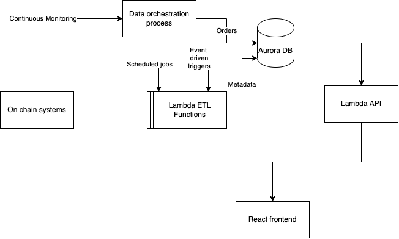

# Optifi Data Orchestration

# Setup
- Create `.env` file with the keys `DATABASE_URL` and `RUST_LOG` keys, where the value for `DATABASE_URL` is a full postgres url, e.g `DATABASE_URL=postgresql://[USERNAME]:[PASSWORD]@[HOST]:[PORT]/[DATABASE]`. Rust log should be `debug`, `info`, etc.
- Available databases: `optifi-dev`, `optifi-prod`, `optifi-sandbox` (note data integrity / correct program behavior should not be expected in `optifi-sandbox`)
- Install diesel - `cargo install diesel_cli --no-default-features --features postgres`
- Build the program and copy the systemctl tasks (assuming on systemd supporting linux environment) - `make install`
- Start the system: `sudo systemctl start optifi_data_orchestration`

